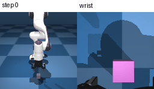

# ACT for Panda Pick-and-Place

A hands-on robot-learning project built with **LeRobot, ACT, MuJoCo, and Gym-HIL**. The project studies teleoperated demonstrations, gripper-action learning, and spatial generalization for a simulated Franka Panda.

> **Current result:** Day15 remains the best policy checkpoint: **9/12 policy-only rollouts on four seen corner positions** and **1/12 on development 2D interpolation**. Day16 added intermediate-X coverage but regressed to **6/24** on its seen positions; the reserved test remains untouched.

> **Day9 diagnosis:** externally freezing Y near the target and supplying close/lift actions produced **2/2 successful diagnostic lifts** at `y=±0.05`. This localizes the positive-side policy-only failure primarily to lateral stopping/calibration, but the intervention is not a policy-only benchmark.

> **Day12:** sequential 2D X/Y training achieved **9/12 policy-only successes** on four seen corner positions.

> **Day13–16:** staged demonstrations and lift-specific weighting improved the best seen result to **9/12**, but Day16 intermediate-X expansion regressed to **6/24** despite reasonable offline metrics. Development 2D interpolation remains poor at **1/12**, and broad 2D generalization has not been demonstrated.

## Policy demo — fixed-position task

This GIF comes from a real policy-only MuJoCo rollout of the Day5 XPU checkpoint using front and wrist observations. It demonstrates the **fixed-position** task and is not evidence of spatial generalization.



## Results

| Experiment | Policy / evaluation | Result | Interpretation |
|---|---|---:|---|
| Initial fixed-position baseline | CPU ACT, 500 steps; policy-only, 10 episodes | **0/10** | The robot moved, but the policy did not reliably close the gripper. |
| Assisted fixed-position diagnostic | ACT motion + external close event, 5 episodes | **5/5** | Confirmed that supplying the close event was sufficient for the learned approach/lift behavior. |
| Improved fixed-position policy | Day5 XPU ACT, 2,000 steps; policy-only, 5 repeated rollouts | **5/5** | First stable policy-only success on the fixed-position task. The runs used the same deterministic reset/task and are not a broad statistical guarantee. |
| Original Day6 spatial dataset | XPU ACT, 2,000 steps | Seen **0/8**, unseen **1/5** | Randomized positions did not yield reliable closed-loop spatial control. |
| Day6 Dense-XY dataset | XPU ACT, 2,000 steps | Seen **0/8**, unseen **2/5** | Denser XY data improved offline action prediction, but online success remained poor. |
| Day6 Precision-XY dataset | XPU ACT, 3,000 steps | Seen **0/8**, unseen **0/5** | Later found to have arm-hidden camera observations; treat visual-policy result as confounded. |
| Day7 Y-axis, corrected camera | XPU ACT, 2,000 steps | Seen **0/6** | Offline Y-direction signal improved (70.5% sign-and-magnitude hit at threshold 0.05), but predicted motion was too small and the robot descended before lateral alignment. |
| Day8 Y-active loss weighting | Same Day7 v2 data; 2,000 XPU updates; five-step replanning | Seen **6/6**; held-out midpoint **5/5**; interior positions **3/6** | Unweighted ACT with five-step replanning remained **0/6** on seen positions. Nonzero interpolation was asymmetric: negative **3/3**, positive **0/3**. |
| Day9 failure localization | Same Day8 checkpoint; fixed close/lift and optional Y freeze diagnostics | Diagnostic **2/2** with Y freeze + fixed close/lift | Both intermediate positions could be grasped/lifted after external Y stopping correction; this is causal diagnosis, not policy-only success. |
| Day10 timing-standardized intermediate Y | Four training positions; weighted ACT; 2,000 XPU updates; five-step replanning | Seen **12/12**; held-out `y=±0.075` **6/6** | Standardized close-to-lift timing improved closed-loop stage transitions and enabled local Y interpolation. Single seed, fixed X. |
| Day11 centered-home X-axis | Fixed Y; active-X + close-frame weighting; 2,000 XPU updates; five-step replanning | Seen **12/12**; held-out X **6/9** | Centered home pose and close weighting enabled reliable seen X control. Held-out interpolation was partial: `x=0.34` 3/3, `x=0.40` 3/3, `x=0.46` 0/3. |
| Day12 sequential 2D X/Y | Four corner positions; active X/Y + close weighting; 2,000 XPU updates; five-step replanning | Seen **9/12** | Three corner combinations succeeded policy-only. The failing `(0.48,-0.075)` corner succeeded with externally forced descent/lift, localizing a 2D stage-transition failure. |
| Day13 Z-weighted 2D ablation | Day12 v2 data; active X/Y/Z weight 4; close weight 4; 4,000 XPU updates | Seen **2/12** | Offline Z prediction was strong, but policy-only lift/stage transitions remained unreliable. |
| Day14 staged 2D, active weight 4 | 40 staged demonstrations; active X/Y/Z weight 4; close weight 4; 7,000 XPU updates | Seen **3/12** | Explicit hover/close-hold/lift structure helped, but active weighting remained too aggressive. |
| Day14 staged 2D, active weight 2 | Same 40 demonstrations; active X/Y/Z weight 2; close weight 4; 7,000 XPU updates | Seen **8/12** | Best current 2D seen result; neutral transition behavior improved. The far negative-Y corner remains unreliable. |
| Day15 staged 2D, lift-specific weight | Same staged dataset; X/Y/Z weight 2; positive-Z lift weight 4; close weight 4; 7,000 XPU updates | Seen **9/12**; held-out **1/12** | Best current seen result, but poor held-out interpolation. Intermediate-X training coverage is the next focus. |
| Day16 staged 2D, intermediate-X coverage | Eight positions; 40 staged demonstrations; Day15 weighting; 7,200 XPU updates | Seen **6/24**; 150-step diagnostic **2/8** | Intermediate-X expansion regressed online behavior; most failures remained genuine stage/transition failures rather than simple timeouts. |

On the Day5 fixed-position data, the offline gripper audit reached **56.1% close-frame hit rate** with **0% hold-frame false-close rate**. Day8 improved active-Y offline sign-and-magnitude hits from **70.5% to 91.5%**, but gripper close hits decreased from **66.7% to 44.2%**. The successful rollouts reinforce that an offline action threshold is not a physical grasp-success criterion. Day7 data-quality caveats and the controlled Day8 results are documented in [`notes/day7.md`](notes/day7.md) and [`notes/day8.md`](notes/day8.md).
Day10 v1 with intermediate positions but inconsistent close-to-lift timing achieved only **3/12** policy-only seen successes. Timing-v2 reduced the close-to-lift gap to approximately 2--8 frames and achieved **12/12** seen and **6/6** held-out policy-only successes. Because timing-v2 also has fewer frames and therefore more effective dataset passes at 2,000 updates, timing consistency is strongly implicated but not isolated as the only causal factor. Full details are in [`notes/day10.md`](notes/day10.md).

## What this project implements

- Teleoperated Panda demonstration collection in Gym-HIL/MuJoCo.
- ACT training from front-camera, wrist-camera, and proprioceptive observations.
- Policy-only and assisted closed-loop rollout evaluation.
- Offline, frame-level action audits for gripper and motion channels.
- Controlled data/training experiments: training duration, longer gripper-close supervision, and denser XY actions.
- Project-local, padding-aware Y-active loss weighting with numerical/gradient tests and loss-recipe provenance in standard ACT checkpoints.
- Project-local active-axis loss weighting for X, Y, or both X/Y channels, plus independent close-frame weighting and numerical tests.
- Explicit evaluator diagnostics for fixed close, fixed lift, and Y-freeze interventions, kept separate from policy-only metrics.
- Intel XPU training/inference validation and CPU/XPU inference comparison.
- Scheduled cube-position recording and separate seen/unseen evaluation schedules.

## Method at a glance

At each control step, ACT receives two RGB views and an 18-dimensional robot state, then predicts a four-dimensional action:

```text
observation = [front image, wrist image, robot state]
action      = [delta_x, delta_y, delta_z, gripper]
```

Training uses `chunk_size=50` and `n_action_steps=10`. Day8's successful evaluation overrides `n_action_steps=5`: predict a chunk, execute its first five actions, then replan. The Day8 intervention weights valid Y-active reconstruction errors by 4, while retaining neutral and other-channel weights of 1 and the upstream KL term. It changes training loss, not inference action magnitude, and does not add a gripper intervention.

## Run the fixed-position experiment locally

Training datasets and model checkpoints are **not included** in this repository. The scripts expect local LeRobot environments and datasets; tested versions and source-revision details are in [`ENVIRONMENT.md`](ENVIRONMENT.md).

### Verify the XPU environment

```bash
conda activate lerobot-xpu
python -c "import torch; print(torch.__version__, torch.xpu.is_available(), torch.xpu.get_device_name(0) if torch.xpu.is_available() else '')"
```

### Train the Day5 policy

```bash
bash scripts/day5_act_gripper_longer_xpu.sh
```

This expects a local LeRobot dataset. The training scripts derive `PROJECT_ROOT` from their own location and support these overrides:

- `DATASET_ROOT`: local dataset directory
- `DATASET_REPO_ID`: LeRobot dataset identifier
- `OUTPUT_DIR`: checkpoint/log output directory

For example:

```bash
DATASET_ROOT=/data/my-panda-data \
DATASET_REPO_ID=my-user/my-panda-data \
OUTPUT_DIR="$PWD/outputs/experiment-01" \
bash scripts/day5_act_gripper_longer_xpu.sh
```

Scripts refuse to overwrite existing output directories. The default dataset paths still assume a local `$HOME/robotics/data` layout.

### Evaluate one policy-only episode and optionally save a GIF

```bash
python scripts/evaluate_panda_act.py \
  --device xpu \
  --checkpoint outputs/act_panda_day5_gripper_longer_xpu_v1/checkpoints/002000/pretrained_model \
  --episodes 1 \
  --gripper-mode policy \
  --gif-output assets/my_rollout.gif \
  --gif-camera side-by-side
```

GIF capture requires one episode. It records the actual front/wrist observations from the rollout; it can capture a failure as well as a success, so check the terminal success/reward before presenting the clip as a successful demonstration.

## Day6 spatial and Day7 Y-axis experiments

Datasets and checkpoints are local; schedules, scripts, and summary results are included. The Day6 Gym-HIL aliases require a small patch to the LeRobot source checkout. Tested package versions, source revision, and patch notes are recorded in [`ENVIRONMENT.md`](ENVIRONMENT.md). Experiment details and data-quality caveats are documented in [`notes/day6.md`](notes/day6.md) and [`notes/day7.md`](notes/day7.md).

## Day8 controlled Y-axis improvement

Day8 reuses the corrected Day7 v2 demonstrations: fixed `x=0.48`, ten successful episodes at each of `y=-0.10/+0.10`. It changes only the Y-active loss weighting in training; the evaluation execution-block length is tested separately. The adapter does not edit installed LeRobot source, and saved checkpoints load with the ordinary ACT audit/evaluator.

| Training objective | Evaluation `n_action_steps` | Seen result |
|---|---:|---:|
| Unweighted ACT | 10 | 0/6 |
| Unweighted ACT | 5 | 0/6 |
| Y-active weight 4 | 10 | 0/2 pilot |
| Y-active weight 4 | 5 | 6/6 |

All training uses seed 1000; evaluation repeats essentially deterministic resets at a small set of positions. This is not a multi-seed statistical claim. With the weighted/n5 policy, held-out `y=0.00` succeeded **5/5**, `y=-0.05` succeeded **3/3**, and `y=+0.05` failed **0/3**. A post-failure n1 diagnostic remained **1/2** and is kept separate from the n5 results.

With the tested environment and local v2 data available, check the loss implementation and train using:

```bash
python -m unittest discover -s tests -p 'test_day8*.py' -v
bash scripts/day8_act_y_weighted_xpu.sh
```

Datasets and checkpoints are not bundled. The launcher accepts the dataset/output overrides described above and `Y_ACTIVE_WEIGHT`, `STEPS`, `LOG_FREQ`, `PROGRESS_MINITERS`, `SAVE_LOG`, and `JOB_NAME`. Progress-bar refresh defaults to every 50 steps. Set `SAVE_LOG=1` to additionally capture terminal output beside the run directory. It writes `day8_loss_recipe.json` into each checkpoint. Do not use vanilla `lerobot-train` to resume this custom-loss experiment; resume is intentionally unsupported.

Evaluate the trained positions with the successful setting:

```bash
python scripts/evaluate_panda_act.py \
  --device xpu \
  --checkpoint outputs/act_panda_day8_y_weighted_w4_xpu_v1/checkpoints/002000/pretrained_model \
  --task PandaPickCubeKeyboardRandomLong-v0 \
  --position-schedule configs/day7_y_axis_seen_eval_positions.json \
  --episodes 6 --max-steps 150 --n-action-steps 5 \
  --gripper-mode policy --debug-geometry
```

Full methods and caveats: [`notes/day8.md`](notes/day8.md). Recorded evidence: [`results/day8_summary.json`](results/day8_summary.json), the offline audit CSV, and five rollout logs in `results/`.

Day9 failure-localization methods and logs are documented in [`notes/day9.md`](notes/day9.md), with structured results in [`results/day9_summary.json`](results/day9_summary.json). The diagnostic flags in `scripts/evaluate_panda_act.py` are not enabled by default and must not be used to claim policy-only success.

## Day10 intermediate-Y interpolation

Day10 trains on four fixed-X positions:

```text
x=0.48
y ∈ {-0.10, -0.05, +0.05, +0.10}
```

The timing-v2 checkpoint is:

```text
outputs/act_panda_day10_intermediate_timing_w4_xpu_v1/checkpoints/002000/pretrained_model
```

With `n_action_steps=5` and policy-only gripper execution:

| Evaluation | Result |
|---|---:|
| Four seen training positions, 3 repeats each | **12/12** |
| Held-out `y=-0.075/+0.075`, 3 repeats each | **6/6** |

The held-out positions were not used for training. This is local one-dimensional
interpolation at fixed X, not broad 2D spatial generalization. Full methods and
caveats are in [`notes/day10.md`](notes/day10.md), with structured evidence in
[`results/day10_summary.json`](results/day10_summary.json).

## Day11 centered-home X-axis control

Day11 moves the initial TCP to approximately `x=0.402` using the project-local
home pose `configs/day11_home_x_centered.json`. This makes a symmetric X-axis
experiment feasible within the safe cube range. The dataset uses:

```text
x ∈ {0.32, 0.36, 0.44, 0.48}, y=0.00
```

The active-axis loss adapter now supports both X/Y weighting and an independent
close-frame weight. The final Day11 checkpoint uses:

```text
active X weight = 4
close-frame weight = 4
minimum TCP Z = 0.008
evaluation n_action_steps = 5
```

The close-weighted checkpoint achieved **12/12** policy-only successes on the
four seen X positions. Held-out interpolation achieved **6/9**:

```text
x=0.34: 3/3
x=0.40: 3/3
x=0.46: 0/3
```

The `x=0.46` target is physically graspable: a delayed close/lift diagnostic
succeeded. Its policy-only failure is therefore a stage-timing/interpolation
issue, not proof that the target is unreachable. Details and limitations are in
[`notes/day11.md`](notes/day11.md), with structured results in
[`results/day11_summary.json`](results/day11_summary.json).

## Day12 sequential 2D X/Y compositional control

Day12 combines the validated one-dimensional X and Y skills at four fixed-home
corner positions:

```text
(0.32,-0.075), (0.32,+0.075),
(0.48,-0.075), (0.48,+0.075)
```

The demonstrations use a consistent sequential order:

```text
X movement → Y movement → descend → close → lift
```

No simultaneous X/Y action labels were present, so this is sequential 2D
compositional control rather than diagonal-action supervision. The active-axis
loss weights both X and Y errors by 4 and close-frame errors by 4.

Policy-only seen result, three repeats per corner:

```text
(0.32,-0.075): 3/3
(0.32,+0.075): 3/3
(0.48,+0.075): 3/3
(0.48,-0.075): 0/3
total: 9/12
```

The failing `(0.48,-0.075)` corner succeeded in a diagnostic with X/Y frozen,
forced descent, policy gripper, and forced lift (`1/1`). This is not a new
policy-only result; it localizes the remaining failure to the combined 2D
approach-to-descent transition. Details and evidence are in
[`notes/day12.md`](notes/day12.md) and [`results/day12_summary.json`](results/day12_summary.json).

## Project layout

```text
assets/     Policy rollout GIF used in this README
configs/    Training, recording, and seen/unseen position schedules
notes/      Day-by-day experiment logs and XPU migration record
patches/    Local LeRobot source patch required by the Day6 Gym-HIL integration
ENVIRONMENT.md  Tested CPU/XPU package versions and patch provenance
results/    Baselines and offline audit summaries/CSVs
scripts/    Training, recording, evaluation, and dataset-inspection tools
tests/      CPU correctness tests for the custom weighted ACT training loss
```

## Limitations and next experiment

- The Day5 `5/5` result is for a **fixed cube position** in a deterministic simulator; it is not a broad manipulation success-rate claim.
- Day10 demonstrates local Y interpolation at fixed X, but X, object appearance, home configuration, and simulator remain fixed; this is not broad 2D spatial generalization.
- Day12–16 are controlled 2D compositional experiments, not broad spatial generalization. The best current seen result is Day15 at `9/12`; Day16 regressed to `6/24`, while development 2D interpolation is only `1/12`.
- All reported Day8 training comparisons use one seed. Repeated rollouts at identical positions primarily demonstrate repeatability, not coverage of a wide test distribution.
- Day10 timing-v2 has fewer frames than Day10 v1, so the same 2,000 updates produce more dataset passes. A matched-pass replication is needed to isolate timing consistency from training exposure.
- Offline action prediction is diagnostic and does not guarantee closed-loop task success.
- The next investigation should preserve endpoint coverage while adding intermediate-X demonstrations. The reserved Day16 test combinations remain untouched and must not be used for tuning.

## Hardware

The XPU experiments were run with PyTorch `2.10.0+xpu` on an Intel Arc B390. XPU training, checkpoint loading, offline inference, and MuJoCo online inference were validated. See [`notes/xpu_migration.md`](notes/xpu_migration.md) for timing and the non-blocking PyAV video-decoder fallback note.

## License

No license is currently specified. Contact the author before reusing or redistributing this repository's code.
